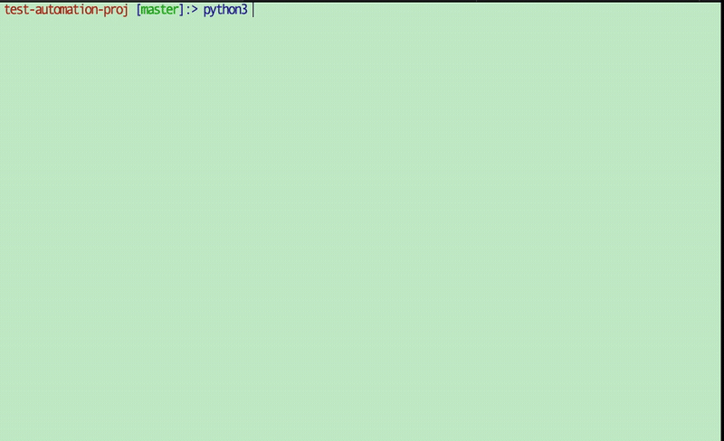

<a id="readme-top" name="readme-top"></a>
# Blockgraph Testing Team Take Home

<!-- PROJECT LOGO -->
<br />
<div class="logo-container" align="center">
  <a href="https://www.blockgraph.co/">
    
  </a>
</div>

<!-- TABLE OF CONTENTS -->
<details>
  <summary><h3>Table of Contents</h3></summary>
  <ol>
    <li>
      <a href="#about-the-project">About The Project</a>
      <ul>
        <li><a href="#instructions">Instructions</a></li>
        <li><a href="#deliverable">Deliverable</a></li>
        <li><a href="#hints">Hints</a></li>
      </ul>
    </li>
    <li>
      <a href="#my-approach">My Approach</a>
      <ul>
        <li><a href="#built-with">Built With</a></li>
      </ul>
    </li>
    <li><a href="#be-aware">Be Aware</a></li>
    <li>
      <a href="#python">Python</a>
      <ol>
        <li>
          <a href="#getting-started">Getting Started</a>
          <ul>
            <li><a href="#prerequisites">Prerequisites</a></li>
            <li><a href="#installation">Installation</a></li>
          </ul>
        </li>
        <li>
          <a href="#usage">Usage</a>
          <ul>
            <li><a href="#using-other-data">Using Other Data</a></li>
            <li><a href="#output-to-file">Output To File</a></li>
            <li><a href="#running-tests">Running Tests</a></li>
          </ul>
        </li>
        <li>
          <a href="#notes-on-implementation">Notes On Implementation</a>
          <ul>
            <li><a href="#how-it-works">How It Works</a></li>
            <li><a href="#other-considerations">Other Considerations</a></li>
          </ul>
        </li>
      </ol>
    </li>
    <li>
      <a href="#javascript">JavaScript</a>
      <ol>
        <li>
          <a href="#getting-started-1">Getting Started</a>
          <ul>
            <li><a href="#prerequisites-1">Prerequisites</a></li>
            <li><a href="#installation-1">Installation</a></li>
          </ul>
        </li>
        <li>
          <a href="#usage-1">Usage</a>
          <ul>
            <li><a href="#using-other-data-1">Using Other Data</a></li>
            <li><a href="#output-to-file-1">Output To File</a></li>
            <li><a href="#running-tests-1">Running Tests</a></li>
          </ul>
        </li>
        <li>
          <a href="#notes-on-implementation-1">Notes On Implementation</a>
          <ul>
            <li><a href="#how-it-works-1">How It Works</a></li>
            <li><a href="#other-considerations-1">Other Considerations</a></li>
          </ul>
        </li>
      </ol>
    </li>
  </ol>
</details>


<!-- ABOUT THE PROJECT -->
## About The Project

<center>
  
</center>

The Blockgraph team assigned me a take-home project to assess my overall engineering capabilities. They provided a zip file containing a README, which includes instructions, deliverables, and hints. Please find the detailed content of the README below:

### Instructions
This zip file includes the following sample data. Assume these are customers on the email list for Store1 and Store2.
* Store1.csv
* Store2.csv

We want to determine which customers that patronize both Alice's Aquariums and Bob's Books. The
list of customer's from Alice's Aquariums in Store1.csv and Bob's Books in Store2.csv. Customers
are uniquely identified by their first and last name, age, and state of residence. Each time a
customer patronizes a store an entry is added to the ledger in the store's csv file.
intersection of customers between Store1 and Store2. Specifically, 
* Create a function that takes in two distinct filenames as inputs. You may assume that these are
  always distinct.
* Determine which customers have patronized both stores and output them in a list.
* Customers are defined by first and last name, age, and state of residence. This means that your
  output list should be a list of Customer objects/structs/dictionaries with these four fields

Please include unit test cases. Use whatever programming language you feel comfortable with. 

### Deliverable
* Please include files related to the take home exercise in the same zip/tar.gz or otherwise compressed file.
* Considering your personal life and busy schedule, you will have 2-3 days to complete this exercise although there is no penalty for taking longer should you need to.

### Hints
* Please include a short summary of how your code works. (This is a test on documentation as well as engineering)
* Feel free to write as many helper functions as needed for easier testing and readability

<p align="right">(<a href="#readme-top">back to top</a>)</p>

## My Approach
For this project, I considered the programming experience mentioned in the job description, which included Java, Go, JavaScript, TypeScript, and scripting experience in either Python or Bash. Based on these qualifications, I decided to implement the project using TypeScript/JavaScript and, time permitting, also explore the possibility of using Python. 
### Built With

[![Python][Python.com]][Python-url]
[![TypeScript][TypeScript.com]][TypeScript-url]
[![JavaScript][JavaScript.com]][JavaScript-url]
[![Node][Node.com]][Node-url]

## *Be Aware*

Moving forward, the README is divided into two distinct sections: [__Python__](#python) and [__JavaScript__](#javascript). Both sections are equivalent in the sense that they achieve the same objective but using different programming languages. I encourage you to try both approaches, but feel free to choose the language you are most comfortable with.

<p align="right">(<a href="#readme-top">back to top</a>)</p>

# Python

The Python version of this project is implemented using a script file called `run.py`, which acts as a small adapter that utilizes the methods defined in the `compare.py` file, where the actual logic resides.

<!-- GETTING STARTED -->
## Getting Started

### Prerequisites

This project is designed to run on Python 3. While most of the functionality also works on Python 2, there may be issues with writing to files and running tests. Therefore, this documentation assumes that Python 3 will be used.

### Installation

1. If you are using a Mac, the easiest way to install Python 3 is by using Homebrew. You can install Python 3 with the following command:

* Installing python3 on Mac with Homebrew

  ```sh
  brew install python
  ```

  If you're using a different operating system, or don't have Homebrew, you can download the latest version of Python from the official website [here](https://www.python.org/downloads/).

2. After installing Python 3, you can check the version number to verify the installation:

   ```sh
    ~> python3 -V
    Python 3.11.1
   ```

<p align="right">(<a href="#readme-top">back to top</a>)</p>

<!-- USAGE EXAMPLES -->
## Usage

Once Python is installed, running the script is simple. From the root folder, use the `python3` command followed by the name of the file to run the script:

   ```sh
    test-automation-proj ~> python3 compare_py/run.py
    Customers that are in both lists:  [{'first_name': 'James', 'last_name': 'Davis', ...
   ```

In the example above, the script outputs an array of dictionaries that lists the customers who have patronized both stores.

### Using Other Data 

By default, the script uses the provided `Store1.csv` and `Store2.csv` files. However, if you want to use your own data, you can do so! To use your own data, follow these steps:

1. Ensure that your data is in a CSV file with the same format as the Store files (comma-delimited with the headers `First Name`, `Last Name`, `Age`, `State`).

2. Copy your data CSV file into the root directory.

3. To run the script with your data, specify the file names you want to compare. For example, if you copied a file named `custom_data.csv` and want to compare it with the provided `Store1.csv`, the command would look like this:

   ```sh
    test-automation-proj:> python3 compare_py/run.py Store1.csv custom_data.csv
    Customers that are in both lists:  [{'first_name': 'Leo', 'last_name': ...]
    ```

### Output To File

You also have the option to save the customers to a new CSV file. Simply specify a filename, and the results will be saved in the root directory. Continuing the example above, if you wanted to save the output of comparing `Store1.csv` and `custom_data.csv` to a file named `new_comparison.csv`, the command would be:

   ```sh
    test-automation-proj:> python3 compare_py/run.py Store1.csv custom_data.csv new_comparison.csv
    Customers saved to:  new_comparison.csv
   ```
You will now find the file `new_comparison.csv` in the root directory, containing all the customers that are in both lists.

### Running Tests

Running tests is straightforward. To run the tests, type the following command:

   ```sh
  test-automation-proj:> python3 compare_py/test_compare.py 
........
----------------------------------------------------------------------
Ran 8 tests in 0.017s

OK
   ```
   This command executes the test cases, and if all tests pass, you will see an "OK" message.

<p align="right">(<a href="#readme-top">back to top</a>)</p>

## Notes On Implementation

### How It Works

In this implementation, the `run.py` file serves as the entry point for the application. It coordinates the usage of three methods from the `compare.py` file to produce a result:

- `csv_to_data_set`: This method takes a CSV file and converts the data into an array of dictionaries.
- `intersection`: *__CORE LOGIC__* This is the crucial part of the implementation. The intersection method compares the arrays and returns the intersection set.
- `print_intersection`: This method takes the result from the `intersection` method and presents it to the user, either by printing it to the screen or writing it to a file according to their preference.

### Other Considerations

- I had some difficulties while attempting to run tests on the `run.py` script file. However, I believe this is not a major concern since the script mainly functions as an adapter, and any issues with it would likely be evident and result in the script failing. I wanted to mention this limitation, but it should not significantly impact the functionality of the application. I am open to feedback on this point, of course.

<p align="right">(<a href="#readme-top">back to top</a>)</p>

# JavaScript

This project is also written in TypeScript, which gets compiled to JavaScript. Similar to the Python version, the `js-entrypoint` acts as a small adapter that leverages the `test-automation-lib` where the real logic is contained and is written completely in TypeScript. 

This project is also written in TypeScript, which is then compiled to JavaScript. Similar to the Python version, the `js-entrypoint` serves as a small adapter that utilizes the `test-automation-lib` where the actual logic is implemented, and it is written entirely in TypeScript.

<!-- GETTING STARTED -->
## Getting Started

### Prerequisites

To set up and run the project, you'll need to have Yarn and Node installed with the following __minimum versions__:

- Node 18
- Yarn 3

### Installation

1. If you're using a Mac, the easiest way to download Node and Yarn is through Homebrew:

* Installing Node and Yarn on Mac with Homebrew

  ```sh
  brew install node
  brew install yarn
  ```
Otherwise, you can download them from the following links:

- [Node](https://nodejs.org/en/download)
- [Yarn](https://yarnpkg.com/getting-started/install)

2. Once installed, verify the versions by running the following commands:

   ```sh
    ~> node -v
    v18.16.0
    ~> yarn -v
    3.6.0
   ```

### NOTE: These next few steps can be a bit tricky. Please take note of the folder you're working in when you're running the commands.

3. Next, set up the `test-automation-lib` by navigating to the `test-automation-lib` folder and running `yarn install` followed by `yarn build`:

   ```sh
    test-automation-lib:> yarn install
    ➤ YN0000: ┌ Resolution step
    ➤ YN0032: │ fsevents@npm:2.3.2: Implicit dependencies on node-gyp are discouraged
    ➤ YN0061: │ @npmcli/move-file@npm:2.0.1 is deprecated: This functionality has been moved to @npmcli/fs
    ➤ YN0000: └ Completed in 4s 591ms
    ...
    ...
    ...
    ➤ YN0000: Done with warnings in 9s 45ms

    test-automation-lib:> yarn build
   ```


4. After completing the setup of `test-automation-lib`, we need to configure the `js-entrypoint` folder to use the compiled JavaScript from `test-automation-lib`. To do this, navigate to the `js-entrypoint` folder from the root directory and run `yarn setup`:

   ```sh
    js-entrypoint:> yarn setup
    ➤ YN0000: ┌ Resolution step
    ➤ YN0000: └ Completed
    ➤ YN0000: ┌ Fetch step
    ...
    ...
    ...
    ➤ YN0000: Done with warnings in 0s 187ms
   ```

    *Running the yarn setup command in the `js-entrypoint` folder establishes the necessary link between the `js-entrypoint` and the compiled JavaScript from the `test-automation-lib`. This enables the `js-entrypoint` to utilize the functionality provided by the compiled code.*

<p align="right">(<a href="#readme-top">back to top</a>)</p>

<!-- USAGE EXAMPLES -->
## Usage

Once you've got Node and Yarn installed and have completed all the necessary setup steps mentioned earlier, __navigagte to the root folder__ and type the following command to run the script:

   ```sh
  test-automation-proj:> node js-entrypoint/index.js 
Error while trying to build a new CustomerBuilder: age ""Age"" is invalid
...
...
Customers that are in both lists: [
  {
    firstName: 'Charlotte',
    lastName: 'Wilson',
    age: 58,
    stateOfResidence: 'Idaho'
  },
  {
    firstName: 'James',
    lastName: 'Davis',
  ...
   ```

- *NOTE: there will be a series of errors before the final result is returned. This is explained [here](#other-considerations-1).*

The default output is an array of dictionaries listing the customers who have patronized both stores.

### Using Other Data

The default behavior for this script is to use the provided `Store1.csv` and `Store2.csv` files. If you want to use your own data for comparison, follow these steps: 

1. Ensure that your data is in a CSV format, following the same structure as the provided Store files (comma-delimited with the headers `First Name`, `Last Name`, `Age`, `State`).

2. Copy your data CSV file into the root directory of the project.

3. To run the script with your own data, specify the file names you want to compare. For example, if you copied a file named `custom_data.csv` and want to compare it with the provided `Store1.csv`, use the following command:

   ```sh
    test-automation-proj:> node js-entrypoint/index.js Store1.csv custom_data.csv
    ...
    ...
    Customers that are in both lists: [
      {
        firstName: 'Harper',
        lastName: 'Jackson',
        age: 44,
        stateOfResidence: 'Wisconsin'
      },
    ...
    ```

    This will perform the comparison using the specified files.

### Output To File

To save the comparison results to a new CSV file, specify a filename when running the script. The results will be saved in the root directory. Here's an example command:

   ```sh
    test-automation-proj:> node js-entrypoint/index.js Store1.csv custom_data.csv new_comparison.csv
    ...
    Results written to new_comparison.csv
   ```

This will save the results of the comparison between `Store1.csv` and `custom_data.csv` to a file named `new_comparison.csv`.

You should now see the `new_comparison.csv` file containing all the customers found in both lists in the root directory.

### Running Tests

*__PLEASE NOTE: tests only run in test-automation-lib__*

To run the tests, follow these steps:

1. Navigate to the `test-automation-lib` folder.

2. Run `yarn test` to execute the tests:

  ```sh
    test-automation-proj:>  yarn test
    PASS  __tests__/Comparer.spec.ts (5.542 s)
    PASS  __tests__/Customer.spec.ts (5.521 s)
    PASS  __tests__/CustomerBuilder.spec.ts (5.597 s)
    PASS  __tests__/importData.spec.ts (5.633 s)
    PASS  __tests__/compareCustomers.spec.ts (5.667 s)
    PASS  __tests__/CustomerValidator.spec.ts (5.651 s)
    PASS  __tests__/createFileNameWithPath.spec.ts (5.691 s)

    Test Suites: 7 passed, 7 total
    Tests:       23 passed, 23 total
    Snapshots:   0 total
    Time:        6.405 s, estimated 8 s
   ```

<p align="right">(<a href="#readme-top">back to top</a>)</p>

## Notes On Implementation

### How It Works

The JavaScript implementation of the project follows a slightly different approach compared to the Python version. The `compareCustomers` function serves as the orchestrator and utilizes three key functions to perform the necessary operations:

- `importData`: This function takes the CSV data and converts it into a two-dimensional array.
- `intersection`: *__CORE LOGIC__* The `Comparer` class is instantiated with the imported data, and this function compares the arrays to find the intersection set. This set is a list of `Customer` instances.
- `serialize`: The output is serialized by calling the `.getObj` method on the `Customer` instances.

It's worth noting that the `test-automation-lib` adopts a more object-oriented approach compared to the Python version. While the `index.ts` file employs a few functions for data parsing, the `compareCustomers` function relies on the `Comparer` class to encapsulate most of the core logic. The `Comparer` class exposes the `intersection` function where the core comparison logic resides.

### Other Considerations

- When running the app, you'll likely encounter a series of raised errors:
   ```sh
  ~> node js-entrypoint/index.js 
  Error while trying to build a new CustomerBuilder: age ""Age"" is invalid
  Error while trying to build a new CustomerBuilder: firstName is required, lastName is required, stateOfResidence is required
  ...
   ```

  These errors are actually warnings and are a result of attempting to enhance the app's robustness. The app does not assume the presence of headers in the CSV file and does not assume that all rows contain valid data. Therefore, when encountering such situations, the app raises warnings to provide informative feedback. Displaying these errors instead of suppressing them was done intentionally to offer transparency and highlight potential issues.

- TESTS: 
  1. Similar to the Python version, the `js-entrypoint/index.js` file does not have dedicated tests. This is because all the functions called by that file are tested in the TypeScript section.

  2. The testing approach for the `compareCustomers` function may not be ideal. It currently utilizes an integration test strategy, which has its merits. However, for orchestration functions like `compareCustomers`, I think it's preferable to verify that the correct functions are called in the correct order. Due to my limited experience mocking functions with Jest, achieving this preferred approach was challenging.
  
  3. The `randomBadData` helper in the `CustomerValidator.spec.ts` file introduces randomness by choosing different attributes to fail on during testing. While this may not align with traditional testing practices, controlled randomness can be beneficial for evaluating system resilience. Netflix's [Chaos Monkey](https://netflix.github.io/chaosmonkey/) is an example of introducing random failures in production environments to ensure service resiliency. However, it is important to note that randomness in testing should be approached cautiously and with consideration for the specific context and requirements of the system. As always, these are strong convictions loosely held.

- A __TODO__ comment exists in the `compareCustomers` function, suggesting the addition of a delimiter specification capability. Currently, the implementation assumes a comma delimiter for CSV files. Allowing the specification of a delimiter would enhance the robustness of the implementation by accommodating files that use different delimiters such as tabs or semicolons.

<p align="right">(<a href="#readme-top">back to top</a>)</p>

<!-- MARKDOWN LINKS & IMAGES -->
<!-- https://www.markdownguide.org/basic-syntax/#reference-style-links -->
[TypeScript.com]: https://img.shields.io/badge/TypeScript-007ACC?style=for-the-badge&logo=typescript&logoColor=white
[TypeScript-url]: https://www.typescriptlang.org
[JavaScript.com]: https://img.shields.io/badge/JavaScript-F7DF1E?style=for-the-badge&logo=javascript&logoColor=black
[JavaScript-url]: https://www.javascript.com/
[Node.com]: https://img.shields.io/badge/Node.js-43853D?style=for-the-badge&logo=node.js&logoColor=white
[Node-url]: https://nodejs.org/en
[Python.com]: https://img.shields.io/badge/Python-14354C?style=for-the-badge&logo=python&logoColor=white
[Python-url]: https://www.python.org/

